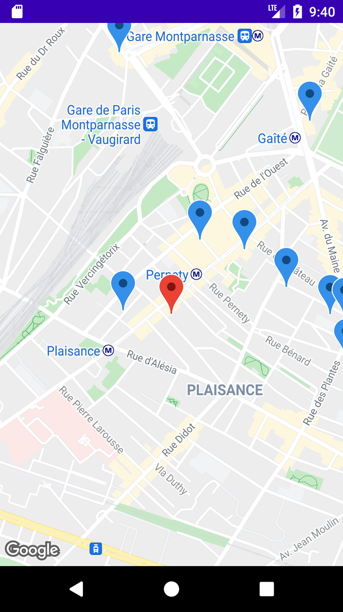
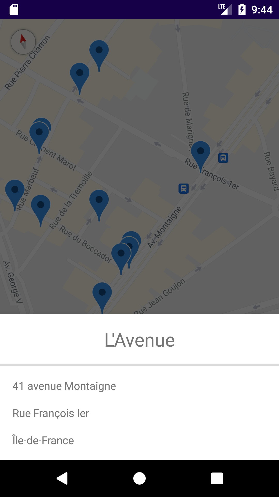

RestaurantFinder
=========================
Introduction
------------

The application is based on MVVM and Repository patterns. Implemented
Architecture principles follow Google recommended [Guide to app architecture](https://developer.android.com/jetpack/guide).

The application is written entirely in Kotlin.

Android Jetpack is used as an Architecture glue including ViewModel, Navigation,
and View Binding.

The application does network HTTP requests via Retrofit, OkHttp and Moshi. 

Kotlin Coroutines and Coroutine Flows manage background threads, data streams with simplified code and reducing needs for callbacks.

Dagger Hilt is used for dependency injection.

MVVM for Architecture Design Pattern

Mockito and Junit for unit testing.

Cashapp/Turbine for flow testing.

A sample app consist of 2 screens: Restaurants, Detail

Screenshots
-----------

Libraries Used
--------------

-Dagger Hilt
-Navigation
-View Binding
-Coroutine & Coroutine Flow
-StateFlow
-Retrofit
-Moshi
-Mockito
-Turbine

